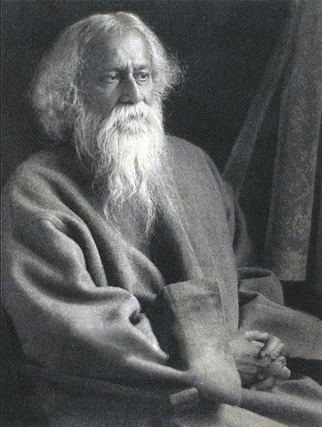

<table class="infobox vcard">
<tbody>
<tr>
<th colspan="2">

Rabindranath Tagore

</th>
</tr>
<tr>
<td colspan="2">

Tagore&nbsp;<abbr title="circa">c.</abbr>&nbsp;1925

</td>
</tr>
<tr>
<th scope="row">Born</th>
<td>Robindronath Thakur 7 May 1861 <a title="Kolkata" href="https://en.wikipedia.org/wiki/Kolkata">Calcutta</a>,&nbsp;<a title="Bengal Presidency" href="https://en.wikipedia.org/wiki/Bengal_Presidency">Bengal Presidency</a>,&nbsp;<a title="British Raj" href="https://en.wikipedia.org/wiki/British_Raj">British India</a>&nbsp;(now&nbsp;<a title="Kolkata" href="https://en.wikipedia.org/wiki/Kolkata">Kolkata</a>,&nbsp;<a title="West Bengal" href="https://en.wikipedia.org/wiki/West_Bengal">West Bengal</a>,&nbsp;<a title="India" href="https://en.wikipedia.org/wiki/India">India</a>)</td>
</tr>
<tr>
<th scope="row">Died</th>
<td>7 August 1941&nbsp;(aged&nbsp;80) <a class="mw-redirect" title="Calcutta" href="https://en.wikipedia.org/wiki/Calcutta">Calcutta</a>,&nbsp;<a title="Bengal Presidency" href="https://en.wikipedia.org/wiki/Bengal_Presidency">Bengal Presidency</a>,&nbsp;<a class="mw-redirect" title="British India" href="https://en.wikipedia.org/wiki/British_India">British India</a>&nbsp;(now&nbsp;<a title="Kolkata" href="https://en.wikipedia.org/wiki/Kolkata">Kolkata</a>,&nbsp;<a title="West Bengal" href="https://en.wikipedia.org/wiki/West_Bengal">West Bengal</a>,&nbsp;<a title="India" href="https://en.wikipedia.org/wiki/India">India</a>)</td>
</tr>
<tr>
<th scope="row">Resting place</th>
<td>Ashes scattered in the&nbsp;<a title="Ganges" href="https://en.wikipedia.org/wiki/Ganges">Ganges</a></td>
</tr>
<tr>
<th scope="row">Occupation</th>
<td class="role">

<ul>
<li>Poet</li>
<li>writer</li>
<li>composer</li>
<li>painter</li>
</ul>

</td>
</tr>
<tr>
<th scope="row">Language</th>
<td>

<ul>
<li><a title="Bengali language" href="https://en.wikipedia.org/wiki/Bengali_language">Bengali</a></li>
</ul>

</td>
</tr>
<tr>
<th scope="row">Nationality</th>
<td class="category"><a class="mw-redirect" title="British India" href="https://en.wikipedia.org/wiki/British_India">British Indian</a></td>
</tr>
<tr>
<th scope="row">Period</th>
<td><a title="Bengali Renaissance" href="https://en.wikipedia.org/wiki/Bengali_Renaissance">Bengali Renaissance</a></td>
</tr>
<tr>
<th scope="row">Literary movement</th>
<td><a class="mw-redirect" title="Contextual Modernism" href="https://en.wikipedia.org/wiki/Contextual_Modernism">Contextual Modernism</a></td>
</tr>
<tr>
<th scope="row">Notable works</th>
<td>

<ul>
<li><em><a title="Gitanjali" href="https://en.wikipedia.org/wiki/Gitanjali">Gitanjali</a></em></li>
<li><em><a title="The Home and the World" href="https://en.wikipedia.org/wiki/The_Home_and_the_World">Ghare-Baire</a></em></li>
<li><em><a title="Gora (novel)" href="https://en.wikipedia.org/wiki/Gora_(novel)">Gora</a></em></li>
<li><em><a title="Jana Gana Mana" href="https://en.wikipedia.org/wiki/Jana_Gana_Mana">Jana Gana Mana</a></em></li>
<li><em><a title="Rabindra Sangeet" href="https://en.wikipedia.org/wiki/Rabindra_Sangeet">Rabindra Sangeet</a></em></li>
<li><em><a class="mw-redirect" title="Amar Shonar Bangla" href="https://en.wikipedia.org/wiki/Amar_Shonar_Bangla">Amar Shonar Bangla</a></em></li>
<li>(<a title="Works of Rabindranath Tagore" href="https://en.wikipedia.org/wiki/Works_of_Rabindranath_Tagore">other works</a>)</li>
</ul>

</td>
</tr>
<tr>
<th scope="row">Notable awards</th>
<td><a title="Nobel Prize in Literature" href="https://en.wikipedia.org/wiki/Nobel_Prize_in_Literature">Nobel Prize in Literature</a> 1913</td>
</tr>
<tr>
<th scope="row">Spouse</th>
<td>

<a title="Mrinalini Devi" href="https://en.wikipedia.org/wiki/Mrinalini_Devi">Mrinalini Devi</a>

(<abbr title="married">m.</abbr>&nbsp;1883;&nbsp;<abbr title="widowed">wid.</abbr>&nbsp;1902)<wbr />

</td>
</tr>
<tr>
<th scope="row">Children</th>
<td>5, including&nbsp;<a title="Rathindranath Tagore" href="https://en.wikipedia.org/wiki/Rathindranath_Tagore">Rathindranath Tagore</a></td>
</tr>
<tr>
<th scope="row">Relatives</th>
<td><a title="Tagore family" href="https://en.wikipedia.org/wiki/Tagore_family">Tagore family</a></td>
</tr>
<tr>
<td colspan="2">
</td>
</tr>
<tr>
<th scope="row">Signature</th>
<td></td>
</tr>
</tbody>
</table>
 

<strong>Rabindranath Tagore</strong>&nbsp;<a class="mw-redirect" title="Fellows of The Royal Asiatic Society of Great Britain and Ireland" href="https://en.wikipedia.org/wiki/Fellows_of_The_Royal_Asiatic_Society_of_Great_Britain_and_Ireland">FRAS</a>&nbsp;(born&nbsp;<strong>Robindronath Thakur</strong>, 7 May 1861&nbsp;&ndash; 7 August 1941;&nbsp;<a title="Sobriquet" href="https://en.wikipedia.org/wiki/Sobriquet">sobriquet</a>&nbsp;<strong>Gurudev</strong>,&nbsp;<strong>Kobiguru</strong>,&nbsp;<strong>Biswakobi</strong>)&nbsp;was a&nbsp;<a title="Bengalis" href="https://en.wikipedia.org/wiki/Bengalis">Bengali</a>&nbsp;poet, writer, composer, philosopher and painter.&nbsp;He reshaped&nbsp;<a title="Bengali literature" href="https://en.wikipedia.org/wiki/Bengali_literature">Bengali literature</a>&nbsp;and&nbsp;<a title="Music of Bengal" href="https://en.wikipedia.org/wiki/Music_of_Bengal">music</a>, as well as&nbsp;<a title="Indian art" href="https://en.wikipedia.org/wiki/Indian_art">Indian art</a>&nbsp;with&nbsp;<a class="mw-redirect" title="Contextual Modernism" href="https://en.wikipedia.org/wiki/Contextual_Modernism">Contextual Modernism</a>&nbsp;in the late 19th and early 20th centuries. Author of the "profoundly sensitive, fresh and beautiful verse" of&nbsp;<em><a title="Gitanjali" href="https://en.wikipedia.org/wiki/Gitanjali">Gitanjali</a></em>,&nbsp;he became in 1913 the first non-European as well as the first lyricist to win the&nbsp;<a title="Nobel Prize in Literature" href="https://en.wikipedia.org/wiki/Nobel_Prize_in_Literature">Nobel Prize in Literature</a>.&nbsp;Tagore's poetic songs were viewed as spiritual and mercurial; however, his "elegant prose and magical poetry" remain largely unknown outside Bengal.&nbsp;He is sometimes referred to as "the&nbsp;<a title="Bard" href="https://en.wikipedia.org/wiki/Bard">Bard</a>&nbsp;of Bengal".

A&nbsp;<a class="mw-redirect" title="Bengali Brahmin" href="https://en.wikipedia.org/wiki/Bengali_Brahmin">Bengali Brahmin</a>&nbsp;from&nbsp;<a class="mw-redirect" title="Calcutta" href="https://en.wikipedia.org/wiki/Calcutta">Calcutta</a>&nbsp;with ancestral&nbsp;<a title="Zamindar" href="https://en.wikipedia.org/wiki/Zamindar">gentry</a>&nbsp;roots in&nbsp;<a class="mw-redirect" title="Burdwan district" href="https://en.wikipedia.org/wiki/Burdwan_district">Burdwan district</a>&nbsp;and&nbsp;<a title="Jessore District" href="https://en.wikipedia.org/wiki/Jessore_District">Jessore</a>, Tagore wrote poetry as an eight-year-old.&nbsp;At the age of sixteen, he released&nbsp;<a class="mw-redirect" title="Bhānusiṃha Ṭhākurer Paḍāvalī" href="https://en.wikipedia.org/wiki/Bh%C4%81nusi%E1%B9%83ha_%E1%B9%ACh%C4%81kurer_Pa%E1%B8%8D%C4%81val%C4%AB">his first substantial poems</a>&nbsp;under the pseudonym&nbsp;<em>Bhānusiṃha</em>&nbsp;("Sun Lion"), which were seized upon by literary authorities as long-lost classics.&nbsp;By 1877 he graduated to his first short stories and dramas, published under his real name. As a&nbsp;<a class="mw-redirect" title="Humanist" href="https://en.wikipedia.org/wiki/Humanist">humanist</a>,&nbsp;<a class="mw-redirect" title="Universalist" href="https://en.wikipedia.org/wiki/Universalist">universalist</a>,&nbsp;<a title="Internationalism (politics)" href="https://en.wikipedia.org/wiki/Internationalism_(politics)">internationalist</a>, and ardent anti-nationalist,&nbsp;he denounced the&nbsp;<a title="British Raj" href="https://en.wikipedia.org/wiki/British_Raj">British Raj</a>&nbsp;and advocated independence from Britain. As an exponent of the&nbsp;<a class="mw-redirect" title="Bengal Renaissance" href="https://en.wikipedia.org/wiki/Bengal_Renaissance">Bengal Renaissance</a>, he advanced a vast canon that comprised paintings, sketches and doodles, hundreds of texts, and some two thousand songs; his legacy also endures in the institution he founded,&nbsp;<a title="Visva-Bharati University" href="https://en.wikipedia.org/wiki/Visva-Bharati_University">Visva-Bharati University</a>.

Tagore modernised Bengali art by spurning rigid classical forms and resisting linguistic strictures. His novels, stories, songs, dance-dramas, and essays spoke to topics political and personal.&nbsp;<em><a title="Gitanjali" href="https://en.wikipedia.org/wiki/Gitanjali">Gitanjali</a></em>&nbsp;(<em>Song Offerings</em>),&nbsp;<em><a title="Gora (novel)" href="https://en.wikipedia.org/wiki/Gora_(novel)">Gora</a></em>&nbsp;(<em>Fair-Faced</em>) and&nbsp;<em>Ghare-Baire</em>&nbsp;(<em><a title="The Home and the World" href="https://en.wikipedia.org/wiki/The_Home_and_the_World">The Home and the World</a></em>) are his best-known works, and his verse, short stories, and novels were acclaimed&mdash;or panned&mdash;for their lyricism, colloquialism, naturalism, and unnatural contemplation. His compositions were chosen by two nations as national anthems: India's "<a title="Jana Gana Mana" href="https://en.wikipedia.org/wiki/Jana_Gana_Mana">Jana Gana Mana</a>" and&nbsp;<a title="Bangladesh" href="https://en.wikipedia.org/wiki/Bangladesh">Bangladesh</a>'s "<a class="mw-redirect" title="Amar Shonar Bangla" href="https://en.wikipedia.org/wiki/Amar_Shonar_Bangla">Amar Shonar Bangla</a>". The&nbsp;<a title="Sri Lanka Matha" href="https://en.wikipedia.org/wiki/Sri_Lanka_Matha">Sri Lankan national anthem</a>&nbsp;was inspired by his work.

 

<h2>Books </h2>

<ul>

                             

 <li><a target="_blank" href="https://github.com/manjunath5496/Rabindranath-Tagore-Books/blob/master/rb(1).pdf" style="text-decoration:none;">Gitanjali: Song Offerings</a></li>

 <li><a target="_blank" href="https://github.com/manjunath5496/Rabindranath-Tagore-Books/blob/master/rb(2).pdf" style="text-decoration:none;">The Complete Works of Rabindranath Tagore</a></li>

<li><a target="_blank" href="https://github.com/manjunath5496/Rabindranath-Tagore-Books/blob/master/rb(3).pdf" style="text-decoration:none;">The Home and the World</a></li>
 <li><a target="_blank" href="https://github.com/manjunath5496/Rabindranath-Tagore-Books/blob/master/rb(4).pdf" style="text-decoration:none;">Gora</a></li>                              
<li><a target="_blank" href="https://github.com/manjunath5496/Rabindranath-Tagore-Books/blob/master/rb(5).pdf" style="text-decoration:none;">
Kabuliwala </a></li>
<li><a target="_blank" href="https://github.com/manjunath5496/Rabindranath-Tagore-Books/blob/master/rb(6).pdf" style="text-decoration:none;">Stray Birds</a></li>
 <li><a target="_blank" href="https://github.com/manjunath5496/Rabindranath-Tagore-Books/blob/master/rb(7).pdf" style="text-decoration:none;">The Post Office</a></li>

 <li><a target="_blank" href="https://github.com/manjunath5496/Rabindranath-Tagore-Books/blob/master/rb(8).pdf" style="text-decoration:none;"> Sadhana – The Realisation of Life </a></li>
   <li><a target="_blank" href="https://github.com/manjunath5496/Rabindranath-Tagore-Books/blob/master/rb(9).pdf" style="text-decoration:none;">The Gardener ⎯ Beautiful Love Poems</a></li>
  
   
 <li><a target="_blank" href="https://github.com/manjunath5496/Rabindranath-Tagore-Books/blob/master/rb(10).pdf" style="text-decoration:none;">Nationalism
in India</a></li>                              
<li><a target="_blank" href="https://github.com/manjunath5496/Rabindranath-Tagore-Books/blob/master/rb(11).pdf" style="text-decoration:none;">My boyhood days</a></li>
<li><a target="_blank" href="https://github.com/manjunath5496/Rabindranath-Tagore-Books/blob/master/rb(12).pdf" style="text-decoration:none;">The Religion of Man</a></li>
<li><a target="_blank" href="https://github.com/manjunath5496/Rabindranath-Tagore-Books/blob/master/rb(13).pdf" style="text-decoration:none;">The Hungry Stones And Other Stories</a></li>

<li><a target="_blank" href="https://github.com/manjunath5496/Rabindranath-Tagore-Books/blob/master/rb(14).pdf" style="text-decoration:none;">Glimpses of Bengal</a></li>
                              
<li><a target="_blank" href="https://github.com/manjunath5496/Rabindranath-Tagore-Books/blob/master/rb(15).pdf" style="text-decoration:none;">My Reminiscences</a></li>

<li><a target="_blank" href="https://github.com/manjunath5496/Rabindranath-Tagore-Books/blob/master/rb(16).pdf" style="text-decoration:none;">Fruit Gathering</a></li>

  <li><a target="_blank" href="https://github.com/manjunath5496/Rabindranath-Tagore-Books/blob/master/rb(17).pdf" style="text-decoration:none;">Creative Unity</a></li>   
  
<li><a target="_blank" href="https://github.com/manjunath5496/Rabindranath-Tagore-Books/blob/master/rb(18).pdf" style="text-decoration:none;">Red Oleanders</a></li> 

  
<li><a target="_blank" href="https://github.com/manjunath5496/Rabindranath-Tagore-Books/blob/master/rb(19).pdf" style="text-decoration:none;">The Spirit of Japan</a></li> 

</ul>
